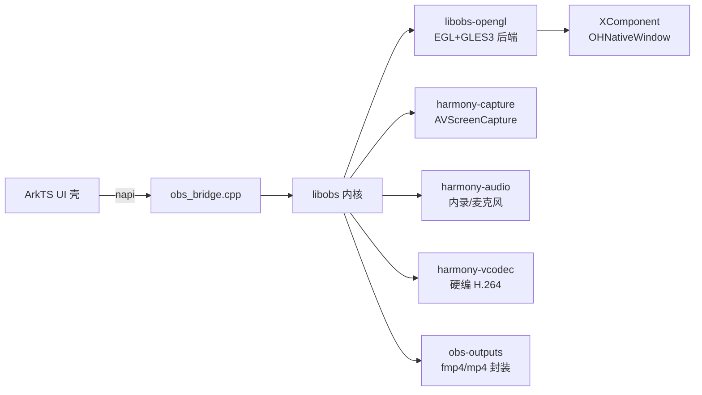

# OBS Studio → HarmonyOS 移植全程纪实

> 本文是面向技术写作的**过程纪实**：每个里程碑、每个 bug 都按「现象 → 排查过程 → 根因 → 修复 → 可复用的教训」记录，事实全部来自真机（HUAWEI MatePad Edge——Pad/PC 双形态设备，HarmonyOS 7.0.0.109，Maleoon 916B GPU，PC/2in1 模式）实测，非纸面推演。
> 与 `harmonyos-session-log.md`（工程交接文档）的分工：那边记"状态与契约"，这边记"故事与因果"。

## 0. 项目速览

- **目标**：把 OBS Studio 32.2.2（桌面直播/录屏软件，C + Qt 生态）移植到 HarmonyOS NEXT（arm64，API 26），产出可用的鸿蒙录屏推流应用。
- **技术路线**：libobs 内核直接交叉编译进鸿蒙（musl libc + NDK），图形走 EGL/GLES3（鸿蒙无桌面 GL），UI 用 ArkTS 重写（放弃 Qt），采集/编码/音频用鸿蒙 NDK 能力写四个原生插件（harmony-capture / harmony-audio / harmony-camera / harmony-vcodec），C 层与 ArkTS 层通过 napi 桥接（obs_bridge.cpp）。
- **成果（截至 2026-10-01）**：真机上 libobs 完整启动、12 个插件加载、GLES 后端跑通、屏幕采集 30fps 帧流入渲染树、**预览实时显示真实桌面画面**。端到端录制成片在攻。



## 1. 阶段一：静态验证期（未上真机）

这阶段的全部工作在 mac 上完成：交叉编译工具链、60 个依赖库（ffmpeg、x264、zlib…）鸿蒙化编译、libobs 平台层（obs-harmony.c、platform-harmony.c）、构建脚本链（build-obs.sh → stage-native.sh → hvigor 打 HAP）。

产出：`check-contracts.sh` 38 项全过、HAP 17MB 可构建。**但此时没有任何一行代码在真机上跑过**——后来证明，静态验证的"全绿"和真机跑通之间隔着一整段黑盒（见第 3 节的 15 个 bug）。

唯一的阻塞：HAP 需要签名。最后用 `devecocli signature generate` 命令行一次搞定（不需要打开 DevEco Studio GUI），profile 核验三件事：bundle-name、设备 UDID 在调试白名单、`CUSTOM_SCREEN_RECORDING` + `INPUT_MONITORING` 进了 allowed-acls。

## 2. 阶段二：首次真机运行（历史性的 6 秒）

装机启动后 6 秒窗口内的日志：安装 ✓、进程存活无崩溃 ✓、`obs_startup` 成功 ✓、插件注册 ✓。**这是整个项目第一次有代码在真机上运行。**

紧接着 UI 完整渲染出来：场景面板、来源按钮、RTMP 推流配置、混音器全在。但顶栏提示 `core: shell only`，`obs_reset_video failed: -1`——图形后端没起来。从这里开始进入图形链排障。

## 3. Bug 编年史（真机才能暴露的 15 个坑）

### 3.0 前提坑：libobs 的日志根本看不见

**现象**：图形模块加载失败，但 hilog 里一行错误都没有。
**根因**：libobs 的 `blog()` 默认写 stderr，鸿蒙应用没有 stderr 控制台，全部蒸发。
**修复**：桥接层 `base_set_log_handler(ObsLogToHilog, nullptr)` 把 blog 转发到 hilog。
**教训**：移植任何 C/C++ 库，第一件事是给它接上宿主日志系统，否则后面全是瞎子摸象。这一步是后面 14 个 bug 能定位的前提。
**小插曲**：libobs 的 `LOG_WARNING`/`LOG_ERROR` 枚举与 hilog 的 `LogLevel` 撞名，同一编译单元里直接编译错误；最终用数值阈值（100=error 200=warning）+ `OH_LOG_Print` 绕过。

### 3.1 GLES shader 四连击

`obs_reset_video` 失败的真实原因接上日志后立刻现形：default.effect 编译失败，连环四个问题。

1. **`out gl_PerVertex` 重声明被拒**。libobs 的 shader 生成器给顶点着色器固定输出 `out gl_PerVertex { vec4 gl_Position; };`——桌面 GL 合法，GLES 3.x 里 `gl_Position` 是内置量，重新声明接口块直接编译错误。修法：`__OHOS__` 分支跳过 `gl_write_interface_block`。
2. **`textureSize` 返回 ivec 不隐式转 vec**。生成器 preamble 里 `vec2 size = textureSize(s, lod)` 在桌面 GL 的宽松规则下能过，ES 严格类型直接报错。修法：显式 `vec2(textureSize(s, lod))`。
3. **`textureLod` 第三参要求 float，传了 int**。`textureLod(s, p, lod)`（lod 是 int）在 ES 下无匹配重载。修法：`textureLod(s, p, float(lod))`。
4. **`4095` 少了小数点**。format_conversion.effect 里 `yuv *= 65535. / 4095;`——float/int 除法，桌面宽容、ES 拒绝。这其实是**上游真实笔误**（基础版写的是 `4095.`，PQ/HLG 两个变体漏了），值得单独给上游提 PR。

**教训**：OBS 的 effect 着色器语言是"桌面 GLSL 方言"，它的 shader parser 生成的 ES 代码要过三关：parser 生成逻辑（gl-shaderparser.c）、effect 源文件本身、驱动严格度。三处都要过一遍。

### 3.2 `sampler2DRect` 是 GLES 保留字

default_rect.effect 用了矩形纹理，GLES 根本没有矩形纹理这个概念，`sampler2DRect` 直接是保留字。修法：`obs.c` 里 `#ifndef __OHOS__` 跳过 default_rect 的加载**和它的成功校验**（两处都要跳，只跳加载会卡在"必需 effect 缺失"）。

### 3.3 `Sample(s, uv, 0)` 的 texel-offset 幽灵

format_conversion.effect 里 5 处 `image.Sample(def_sampler, uv, 0)`——HLSL 的第三参是纹素偏移，libobs 的 GL 翻译器给它生成的代码在 GLES 下找不到合法重载。这 5 处的偏移恒为 0，直接删参。

### 3.4 Maleoon 驱动的 BGRA 三连拒（驱动黑盒标本）

**现象**：`glTexImage2D` 报 `GL_INVALID_OPERATION`，创建的是 GS_BGRA 渲染纹理。
**排查**：加参数 dump 探针，抓到失败三元组 `(internal=0x8C43 SRGB8_ALPHA8, format=0x80E1 BGRA_EXT, type=UNSIGNED_BYTE)`——按 ES 3.0 规范 Table 3.2 这是**合法组合**，且驱动 advertised 了 `GL_EXT_texture_format_BGRA8888`。
**试错**：
- 改 `(RGBA8, BGRA_EXT, BYTE)` → 仍 INVALID_OPERATION
- 改 `(RGBA8, RGBA, 0x8035 UNSIGNED_INT_8_8_8_8_REV)` → 变成 **INVALID_ENUM**——0x8035 这个 type 在 ES 头文件里不存在（我手工补的桌面值），驱动不认
- 最终 `(RGBA8, RGBA, UNSIGNED_BYTE)` → 通过
**教训**：扩展被 advertised ≠ 该扩展的所有组合被实现。国产 GPU 驱动的合规性是"规范是规范，实现是实现"。
**代价**：GS_BGRA 退成 RGBA 后内存字节序不再匹配，色彩通道有隐患（与后文 3.15 的色彩问题可能相关，待精调）。

### 3.5 插件加载：SELinux 和 linker namespace 的双重门

**现象**：`obs_load_all_modules()` 一行日志都不打——目录扫描一个文件都没找到。
**排查**：桥接层直接 `opendir` 插件目录 → **EACCES**。鸿蒙对 bundle libs 目录（`/data/storage/el1/bundle/libs/arm64-v8a`）的 SELinux 策略禁止应用 readdir。
**第一反应错**：改绝对路径 dlopen → linker 报 `check ns accessible failed`，应用进程的 linker namespace 不允许用任意路径打开库。
**正解**：裸 soname。`dlopen("harmony-capture.so")` 这种写法会走 namespace 的 permitted paths，恰好就是 bundle libs。于是桥接层维护一个 12 插件清单，逐个 `obs_open_module(&mod, "%s.so", ...)` 显式加载。
**结果**：12 个插件全部加载（4 个鸿蒙原生 + obs-ffmpeg/filters/outputs/transitions/x264 + rtmp-services + image-source + text-freetype2）。
**教训**：鸿蒙沙箱是"目录不可见 + 路径不可达"两道独立关卡，报错方式完全不同（EACCES vs linker ns），别把两次失败当同一个问题。工程化收尾时这个清单方案要改成更体面的机制（比如清单写进 rawfile 或编译期生成）。

### 3.6 场景从未挂到渲染通道（预览全黑的第一个根因）

**现象**：UI 一切正常，但任何源都不 activate，预览恒黑。
**排查**：源创建 ✓ → 加入场景 ✓ → 但 `obs_source_info.activate` 回调永远不触发 → 说明源从未进入渲染树。
**根因**：`NativeCreateScene` 只调了 `obs_scene_create`，**从未调 `obs_set_output_source(0, scene_source)`**。libobs 的渲染模型是"通道 0 当前节目 → view 枚举 → 渲染"，场景不挂通道就是个孤儿对象。
**修复**：创建场景后补 `obs_set_output_source(0, obs_scene_get_source(scene))`。
**验证**：修复后点 Display 源，activate 在图形线程正确触发。
**教训**：OBS 前端（Qt 版）里"场景列表选中即挂通道"的逻辑藏在几十层调用里，脱离它重写 ArkTS 前端时，必须对着 libobs 的**数据流契约**而不是 API 列表来理解渲染模型。

### 3.7 AVScreenCapture Init 报 OPERATE_NOT_PERMIT：音频配置自相矛盾

**现象**：`OH_AVScreenCapture_Init` 返回 err=2（OPERATE_NOT_PERMIT），字面看像权限问题。
**排查**：权限清单核过全有（CUSTOM_SCREEN_RECORDING 在 allowed-acls、弹窗授权通过）；查官方文档发现 NDK 契约——**音频通道只有在 sampleRate 和 channels 都为 0 时才被忽略**。而代码写了 `sampleRate=48000, channels=2, audioSource=OH_SOURCE_INVALID`：要采集却没有效音源，配置自洽性检查失败，报的错却是"操作不允许"。
**修复**：视频-only 采集把两个音频几何全置 0。display-capture 和 window-capture 同病同修。
**教训**：鸿蒙 NDK 错误码经常"指权限不报权限"。OPERATE_NOT_PERMIT 的第一排查方向应该是**配置合法性**而不是权限。

### 3.8 PC/2in1 的"选择共享内容"Picker（平板跑桌面模式的隐藏交互）

**现象**：Init 成功、Start 成功、状态回调 started，但**视频 buffer 回调一次都不触发**。
**排查**：一度怀疑授权、线程、回调注册 API 用错。最后 dumpLayout 发现屏幕上有一个"选择共享内容"的 Picker 弹窗（被 OBS 窗口挡住一部分），有"开始共享"按钮。
**根因**：这台平板跑在 **HarmonyOS PC/2in1 模式**。该模式下 `OH_CAPTURE_SPECIFIED_SCREEN` 启动后系统会弹内容选择器，**用户确认后才真正开始出帧**——移动端没有的交互。
**修复**：验证脚本里加一步点"开始共享"。产品化时这是必须向用户展示的交互流程。
**教训**：同一套 NDK API 在平板模式/PC 模式/手机模式下交互模型不同，鸿蒙多形态设备的"形态差异"是文档最薄的地方。

### 3.9 GPU buffer 的 CPU 映射返回全零

**现象**：帧回调来了，但拷贝出来的像素全零。
**排查**：首帧诊断打印 `attr.size=8294400`（=1920×1080×4，buffer 完整）、地址非空，但 tl 和 centre 采样全 0。
**根因**：`OH_NativeBuffer_MapAndGetConfig` 对 GPU-usage buffer 返回的是空视图。
**修复**：改用官方样例的 `OH_AVBuffer_GetAddr(buffer)` 直接取址。修复后 centre 采样 = (36,38,43)——正是 OBS 自己深色窗口的背景色，**证明采到的就是真实屏幕**。
**教训**：同一块 buffer，NativeBuffer 和 AVBuffer 两个入口的映射语义不同，以官方样例代码路径为准。

### 3.10 采集帧 alpha 未定义 → 预乘 alpha 下全透明

采集服务给的 RGBA buffer alpha 字节不可靠，而 libobs 源混合用预乘 alpha（ONE, INVSRCALPHA），alpha=0 会让整个源透明成黑。拷贝时强制 alpha=0xFF。

### 3.11 EGL_BAD_NATIVE_WINDOW 每帧刷：借用的窗口指针

**现象**：present 每帧报 `eglSwapBuffers failed: EGL_BAD_NATIVE_WINDOW`。
**根因**：`OnSurfaceCreated(OH_NativeXComponent*, void* window)` 回调给的 `OHNativeWindow*` 是**借用引用**，回调返回后 ArkUI 就把 buffer queue 回收了。基于已死 window 创建的 EGL surface 每帧 swap 必失败。
**修复**：Created/Changed 时 `OH_NativeWindow_NativeObjectReference(window)` 加引用，Destroyed 时释放。错误完全消失。
**教训**：鸿蒙 C API 的"回调参数所有权"没有标注，借用/转移全靠经验和踩坑。这类问题在所有用 XComponent 原生渲染的应用里都存在。

### 3.12 viewport 的 Y 翻转拿宽度当高度

**现象**：present 无错但画面不更新，draw 探针抓到 `viewport=0,1813,2046,233`——y 偏移 1813 = 2046−233。
**根因**：`gl_getclientsize` 用 `OH_NativeWindow_NativeWindowHandleOpt(GET_BUFFER_GEOMETRY)` 拿尺寸，PC 模式下它返回的是**竖屏基准 233×2046**（合成器旋转），Y 翻转公式把 2046 当高度，视口被推到 surface 之外，所有绘制静默落在不可见区。
**修复**：改用 `eglQuerySurface`——EGL surface 才是 viewport 坐标系的权威来源。修复后 viewport 正确，fb 采样从背景色变成 `0,0,0,255`（blit 真的在写字了）。
**教训**：多端形态设备上"窗口尺寸"有三个来源（ArkUI 布局、NativeWindow 几何、EGL surface），**绘制坐标系永远信 EGL**。

### 3.13 锁屏/熄屏造成的"假卡死"（调试环境坑王）

多次"应用白屏卡死 THREAD_BLOCK_6S"，最后发现全是平板自动熄屏的假象：`snapshot_display` 拍到的是熄屏动画白帧，`uitest` 点击无回执。真卡死与假卡死的鉴别：查 `pidof` + `/proc/<pid>/task/*/status`（全 S = 没死）+ 日志时间戳。
对策：`power-shell wakeup` + 双滑解锁手势 + `power-shell setmode 602`（充电常亮）。这台设备一晚吞掉 40+ 分钟的锁屏拉锯。

### 3.14 hvigor 打包缓存坑（构建链的"改了没生效"）

**现象**：源码修复、重编、stage、打 HAP 全绿，装机行为纹丝不动。
**根因**：hvigor 的 PackageHap 步骤在产物时间戳相近时会跳过重打包，HAP 里还是旧 .so。
**对策**：打包前 `mv` 走旧 HAP 强制全链重打；用 `strings` 在 HAP 内的 .so 里 grep 新加的日志标记字符串做**进包验证**。effect 资源同理：stage 脚本从 rundir 拷 rawfile，改了 `libobs/data/*.effect` 必须手工同步三处（rundir、rawfile、重打包）。
**教训**：多段构建链（cmake → stage → hvigor → install）的每一段都可能缓存，验证必须"端到端字符串级"确认新代码到了设备上。

### 3.15 预览黑屏的真正根因：`GL_TEXTURE_RECTANGLE = 0x0DE1`（枚举撞车）

这是全项目最精彩的一个 bug，排查过程横跨 10+ 轮探针实验。

**现象**：链路全绿但预览黑——帧进 source ✓、activate ✓、通道绑定 ✓、draw tick 60Hz ✓、swap 无错 ✓、async 纹理 read-back 有真实内容 ✓，唯独 canvas（render_texture）恒黑。

**排查阶梯**（每步都靠真机探针）：
1. draw callback 里 `glReadPixels` 采样 fb → 恒背景色 → 说明 blit 没写字（引出 3.12 viewport 修复）
2. viewport 修复后 fb 变 `0,0,0,255` → blit 在写了，但 canvas 内容仍是黑
3. 五点位采样 canvas → 全黑；async 纹理 read-back → 有内容。断点收窄到"async 纹理 → canvas 这一笔 sprite draw"
4. 撒 device_draw 全状态探针：topo/verts/viewport/scissor/cull/blend/fbo/prog/tex0bind/fbo_attach/颜色掩码/深度——**全部正确**，无 GL 错误
5. dump GPU 内省：program 的 uniform 表（ViewProj 已正确上传）、attribute 表（pos VEC4→loc0、uv VEC2→loc1，绑定正确）
6. dump 生成的 GLSL 源码 → 与桌面版逐字一致，正确
7. **红帧实验**：CPU 侧把采集帧涂全红 → 预览条变红！→ 管线其实全通，"黑"只是恒采样了某个黑 texel
8. **UV 渐变实验**：涂 `r=u, g=v` 空间渐变 → canvas 五点位恒 (255,255,55) = 右上角 texel raw(255,255,128) 经 sRGB 解码 → **着色器对整幅四边形采样了恒定的角点 UV**
9. **属性缓冲 dump**（`glMapBufferRange` 读 pos/uv 绑定的实际缓冲）：pos 缓冲里是 1×1 精灵的角点，**uv 缓冲里是 0..1920/0..1080 的像素坐标**——这是 `build_sprite_rect`（矩形纹理专用）的产物！普通 2D 纹理为什么会走矩形纹理分支？
10. 查 `gs_texture_is_rect()` → 恒 true → 查 port 的 GLES shim：

```c
// libobs-opengl/harmony/glad/glad.h（修复前）
#define GL_TEXTURE_RECTANGLE 0x0DE1   // ← 这就是 GL_TEXTURE_2D 自己！
```

**根因**：补位用的桌面常量值抄错，`GL_TEXTURE_RECTANGLE`（真值 0x84F5）被定义成了 `GL_TEXTURE_2D`（0x0DE1）。于是每个 2D 纹理都被识别成"矩形纹理"，sprite 绘制走 rect 分支生成**像素坐标 UV**，普通采样器 CLAMP 后恒采样右上角单一 texel。桌面 OBS 永远遇不到这个分支，所以这个 bug 是 port 独有的。

**修复**：一行，改常量值。验证：预览条实时显示真实桌面画面 ✓。

**教训**（写作重点）：
- "全链路探针 + 两个合成实验（红帧/渐变）"把黑盒驱动问题收窄到一行宏定义，是**移植调试方法论**的最佳案例
- 常量补位必须与官方头文件逐值核对，`0x0DE1` 这种"看起来像枚举值"的错误编译器和驱动都不报错——它语义合法，只是含义全错
- 红帧实验的价值：当"看不到画面"时，先证明"能不能看到**任何**画面"，把呈现问题与内容问题一刀切开

## 4. 阶段三：录制闭环（端到端出片）

预览出画面后，"录出一个视频文件"这条路的代码其实大部分已就位——harmony-vcodec（OH_VideoEncoder 硬编）、obs-outputs（mp4 封装）、桥接层的 Start/Stop Recording 都在。但真机一跑，又连环暴露 6 个问题，每一个都是"桌面假设在鸿蒙不成立"的典型。

### 4.1 ffmpeg_muxer 要 fork 子进程 → 鸿蒙沙箱禁止

**现象**：录制启动即失败。
**根因**：OBS 默认录制走 `ffmpeg_muxer` 输出，它 fork 一个 `obs-ffmpeg-mux` 独立 ELF 进程做封装。鸿蒙应用沙箱**禁止 fork/exec 自带可执行文件**（这个 helper 上游在鸿蒙根本没构建产物）。
**修复**：改用 obs-outputs 内置的 `mp4_output`——它是纯进程内的 encoded muxer（直接吃 h264/aac 包写 mp4），无子进程。桥接层 `obs_output_create("mp4_output", ...)` 一行切换。
**教训**：OBS 里"看起来一个东西"的录制，底层有 ffmpeg_muxer（子进程）和 mp4_output（进程内）两条实现，移植要挑无进程依赖的那条。

### 4.2 编码线程没有 GL context（SIGSEGV）

**现象**：点录制 → 应用秒崩，`signo(11) threadName(obs gpu encode)`。
**根因**：libobs 的纹理编码跑在**独立的 "obs gpu encode thread"**（obs-video-gpu-encode.c），这个线程是为 Windows/D3D 设计的——D3D 纹理按 handle 跨线程共享，不需要 GL context。但 EGL/GLES 下，要采样 libobs 创建的 GL 纹理，必须有一个与之共享资源的 context。插件的 `venc_gl_init` 里 `eglGetCurrentContext()` 在这条线程上自然是空 → 后续拿空 context 建 surface → 崩。
**修复**：这是所有 GL 平台纹理编码器（NVENC/QSV 的 GL 版）的标准套路——编码线程自建一个 **share context**。用 `obs_add_main_render_callback` 在图形线程（context 有效处）捕获 libobs 的 master `EGLDisplay/EGLContext/EGLConfig`，编码线程 `eglCreateContext(dpy, cfg, master_ctx, ...)` 建共享 context。
**教训**：libobs 的"渲染"和"编码"是两个线程，跨线程共享 GPU 资源在 GL 语义下必须显式 share context，这是 D3D 移植者最容易忽略的模型差异。

### 4.3 GLES 没有客户端顶点数组（SIGSEGV）

**现象**：共享 context 建好了，仍在 blit 第一帧崩。
**根因**：blit shader 用 `glVertexAttribPointer(loc, 2, GL_FLOAT, ..., venc_fullscreen_vertices)` 传了**CPU 数组指针**。桌面 GL 兼容模式允许无 VBO 时传客户端指针，但 **GLES 要求必须绑定 GL_ARRAY_BUFFER，指针被当作 VBO 内字节偏移** → 驱动把 CPU 地址当偏移解引用 → 段错误。
**修复**：共享 context 里建一个小 VBO，`glBufferData` 上传全屏三角形顶点，blit 时 `glBindBuffer` 后传偏移 0。
**教训**：GLES 是"纯 VBO"世界，任何桌面 GL 里"图方便传指针"的写法在这里都是雷。

### 4.4 gs_texture_get_obj 跨线程返回 NULL

**现象**：VBO 修好后不崩了，但日志 `source texture has no GL object`，编码 0 帧。
**根因**：`gs_texture_get_obj`（拿 GL 纹理名）的 libobs 包装层有 `gs_valid_p` 守卫——要求 `thread_graphics` 非空，而它在编码线程是 NULL（那条线程从没 enter_context）。函数本身只是读一个结构体字段（纯元数据），根本不需要 context，却被守卫挡在门外返回 NULL。
**修复**：给 graphics.c 加一个全局 `gs_singleton`（libobs 只创建一个 graphics 实例），`gs_texture_get_obj` 在 `thread_graphics` 为空时回退到它。纯元数据读取合法跨线程。
**教训**：libobs 的 gs_* 包装层默认"所有调用都在图形线程"，纹理编码器这种跨线程读句柄的场景要专门开绿灯。

### 4.5 录制 UI 按钮不翻牌

**现象**：录制明明在跑（文件在涨），但按钮还写着 "Start Recording"，导致脚本找不到 "Stop Recording" 去停止。
**根因**：`toggleRecording` 成功后依赖 stats 线程异步推回 `recording=true` 才刷新按钮，但 stats 回调首帧推送有延迟。
**修复**：成功后乐观置 `model.stats.recording = true`。

### 4.6 录出来的视频整幅偏红（NV12 双平面）

**现象**：录制成功、文件可播、ffprobe 显示 h264 610 帧 + aac，但抽帧**整幅红色**（画面内容/几何全对，就是颜色错）。
**排查**：预览路径颜色是对的（3.15 修复后），只有录制偏红 → 问题在编码取帧路径。查 `obs_tex_frame` 有 `tex` 和 `tex_uv` 两个字段——这是 **NV12 双平面**纹理（`tf.tex`=Y 平面 GL_R8 单通道、`tf.tex_uv`=UV 平面 GL_R8G8 半分辨率）。而我的 blit shader 只 `texture2D(u_texture, uv).r` 采了 Y 平面当 RGBA 用 → R=luma、G=B=0 → 全红。完美解释症状。
**修复**：blit shader 补 `u_texture_uv`，按 **Rec.709 limited-range**（与 OBS video 设置一致）做 NV12→RGB 转换：`(Y-16)/219`、`(U/V-128)/255`，标准矩阵。
**验证**：重新录制抽帧——蓝色场景高亮、红色 Stop 按钮、自然灰阶全部正确，红偏消失。

### 4.7 端到端成片实证

最终 `recording.mp4`（1.7MB）经 ffprobe 核验：
```
Stream #0  h264  1920x1080  60/1 fps  610 frames   ← 硬件 H.264
Stream #1  aac   stereo     48kHz      477 frames   ← 内录音频
duration 10.17s   bitrate 1.34 Mbps
```
抽帧画面是真实的平板桌面（OBS 窗口 + 设置应用 + 混音器），色彩、几何、文字全部正确。**从"从未上过真机"到"录出一个可播放的 mp4"，全链路闭环达成。**

## 5. 阶段四：RTMP 推流（直播链路）

录制闭环打通后，推流的代码其实已全部接线（rtmp_custom service + rtmp_output + librtmp 都在 obs-outputs 里，进程内无 fork 问题）。真机验证时暴露两个问题：

### 5.1 obs_output_set_service 不加引用计数（service 提前销毁）

**现象**：点 Start Streaming 报 `obs_output_start() failed`，日志里紧跟着 `obs_service_can_connect: Null 'service' parameter`——明明前一行刚 `set_service`。
**根因**：桥接层的写法是 `obs_output_set_service(output, service); obs_service_release(service);`——直觉上"output 接管了所有权"。但 libobs 的 `obs_output_set_service` **只存裸指针、不加引用**（obs-output.c，对比 `set_video_encoder` 会 addref）。我们 release 掉创建引用后，service 引用归零被销毁，output 里留下的是悬空指针，start 时校验直接失败。
**修复**：桥接层用 `g_streamService` 全局持有 service 引用，Stop/清理路径再释放。
**教训**：libobs 的 setter 语义不统一——encoder 加引用、service 不加，移植时每个 setter 都要读实现确认所有权，不能靠命名猜。

### 5.2 服务器环境坑（mediamtx + 局域网）

验证需要一个 RTMP 服务器：brew install 被工作区沙箱拦（sandbox-exec 不可用），改从 GitHub Releases 直接下 darwin_arm64 二进制。`nohup` 起的进程随 shell 退出而死，改用工具的后台任务方式常驻。本地先 `ffmpeg -f flv rtmp://…` 推一路测试流验证服务器与 IPv4 监听正常，再上真机。

### 5.3 端到端推流实证

真机点 Start Streaming → 服务器日志：
```
[RTMP] [conn 192.168.31.75:45288] opened
[path live/obs-test] stream is available and online, 2 tracks (H264, MPEG-4 Audio)
[RTMP] [conn 192.168.31.75:45288] is publishing to path 'live/obs-test'
```
再用 HLS 从服务器拉回流并抽帧：h264 1920×1080 + aac，画面是**真实的平板桌面**（OBS 窗口里套着采集到的自己，蓝色场景条、红色 Stop Streaming 按钮、LIVE 状态全部正确）。停止推流：`Total frames output: 13544`（约 3.7 分钟 @60fps，零中断）。

**至此 OBS 的三大核心能力——预览、录制、推流——全部在 HarmonyOS 真机上跑通。**

### 5.4 顺手抓到的 use-after-free

推流成功日志里 `streaming started to CBR`——server 字符串打印成了垃圾值。根因：`obs_data_release(config)` 之后才用 `server`（指向 config 内部存储）打日志。连接本身没错是因为 service 早已拷贝了值，纯日志读悬空指针。改为先 `std::string serverCopy` 再 release。

### 5.5 后台录制实测（此前疑似 ANR，未复现）

担心"录屏软件切后台就卡死"是致命缺陷，专门做了一轮复现：开始录制 → Home 键切后台 → 3.7 分钟无 THREAD_BLOCK、文件持续增长、采集心跳正常 → 回前台 Stop 干净收尾。拉回成片 23.5MB / 221.4s，抽后台时段（t=120s）的帧是**真实的浏览器新标签页画面**（OBS 在后台时桌面的实际内容）。

**结论**：此前记录的多次"卡死"都是熄屏/锁屏瞬间点击的竞态（§3.13），不是后台录制的结构性问题。"切后台继续录"实测可用。

### 5.6 息屏继续录：一个错误码牵出的长时任务闭环（10-02 晨间补录）

**现象**：`power-shell suspend` 熄屏后，录制文件大小立刻停止增长；约 2 分钟后 `pidof` 查不到进程——应用被系统终止，但 faultlogger 目录为空（不是崩溃）。

**取证**：hilog 里 resource_schedule_service 的 SUSPEND_MANAGER 给出了精确的杀进程理由：

```
Kill Reason: ILLEGAL_AUDIO_CAPTURER_BY_SUSPEND
current has media and not apply background_task or Resource::AUDIO
```

**根因**：OBS 持有麦克风 + PlaybackCapture 两个音频采集器。熄屏挂起时，系统检测到"有媒体采集但没有申请长时任务"，按非法后台音频采集处置直接杀进程。**"息屏继续录"卡了这么久，根因不在采集管线，在后台任务声明缺失**——桌面思维里"录屏软件后台跑"天经地义，鸿蒙里这是需要显式申请、用户可感知（常驻通知）的受约束能力。

**修复**（官方架构指南 harmorecord 模式）：
1. module.json5 EntryAbility 声明 `backgroundModes: ["audioRecording"]`；
2. 新建 `LongRunningTask.ets`：wantAgent + `startBackgroundRunning`（API 21+ 多类型重载，string[] 模式返回 continuousTaskId），引用计数管理（录制与推流共享一个任务，最后一个停止才释放）；
3. 时机遵循"开始即申请、await 成功再返回"消除时序竞争；申请失败不阻断前台输出（降级为亮屏可用）。

**验证**：开始录制 → 熄屏 → 文件以媒体速率持续增长（每 10s +68KB）、进程存活 → 成片 **544 秒** 横跨整个熄屏窗口，熄屏时段为黑帧（合成器熄屏后的真实内容，采集忠实记录），唤醒后画面恢复。**"息屏继续录"闭环达成。**

**教训**：① 鸿蒙"应用被杀"不一定留崩溃日志，SUSPEND_MANAGER 的 Kill Reason 是唯一线索，排查后台失活先查它；② kill reason 里 "has media" 指的是**音频采集器**——一个音频声明缺失就足以让整条视频录制链陪葬；③ 长时任务不是"后台运行的许可"而是"用户可感知的承诺"，通知栏常驻是设计的一部分，不是打扰。

### 5.7 滤镜黑屏：两个根因 + 一次错误归因（10-02）

**现象**：色彩校正滤镜挂上后预览全黑。

**根因一（数据缺失）**：hilog 抓到 `gs_effect_create_from_file: Null 'file' parameter`——obs-filters 等 7 个插件的 `data/` 目录从未 stage 进 HAP rawfile（cmake rundir 在 OHOS 上根本不组装 share/obs）。effect 文件不存在 → 滤镜渲染链断裂。修 stage-native.sh 自动同步 + Index 加 `ASSET_STAMP` 内容戳强制重解压。

**根因二（默认值缺失）**：桥接层 `obs_source_create_private` 传了 nullptr settings，color_filter 的 opacity 读 `obs_data_get_int` 缺 key 返回 0 → 矩阵乘零 → 全黑。正解是 `obs_get_source_defaults(typeId)`——Qt 前端同款路径，走插件 get_defaults hook（opacity=100→1.0）。

**归因弯路（诚实记录）**：期间预览恰好整体黑屏，先后误判为"Maleoon 驱动坏状态"（glGetError 返回垃圾值 0x26D72A00 + EGL_BAD_NATIVE_WINDOW）并重启设备——A/B 装旧构建同样黑，最终 `XComponent surface created: 2046x43` 一条日志定案：**是我把 SideDocks 固定 400 高挤掉了预览空间**（重启后窗口未最大化走堆叠布局）。教训：黑屏先看 surface 尺寸日志，尺寸正常才轮到渲染链；驱动玄学论要先用"旧构建同样复现"来检验。

**顺带的正确修复**：`EntryAbility` loadContent 后 `window.maximize()`——PC/2in1 桌面软件就该最大化启动，一次性解决堆叠布局、来源面板可达性、自动化坐标漂移三个问题。

### 5.8 相机源：三层叠加 bug 的洋葱（10-02）

**现象**：相机源创建成功、`video output frame start`，但预览与成片全黑。

**第一层（元数据撒谎）**：`plane 0 stride 1 smaller than linesize 1920`——`OH_NativeBuffer_MapPlanes` 对 ImageReceiver 送来的 buffer 报 rowStride=1（对 AVScreenCapture 的 buffer 却是好的，§3.9 家族）。改用 Image Kit 自己的 `OH_ImageNative_GetRowStride`（权威源）。又发现相机 NV12 是**单组件半平面**（GetComponentTypes 返回 1 个），Y 和 CbCr 在同一 buffer 内，色度起点 = stride_y × height。

**第二层（拷贝对了仍黑）**：内容探针证明 CPU 侧数据真实（stride_y=1920、nonzero=2080/2080、采样均值 91≈室内亮度），时间戳探针证明时钟正常（delta -61ms），但画面依旧黑，且合成器每帧刷 `GL_INVALID_FRAMEBUFFER_OPERATION`。

**第三层（GPU 拒绝多平面上传）**：libobs 异步帧把 NV12 上传成 GL_R8 + GL_RG16 纹理，Maleoon GLES 驱动不吃这套（display-capture 之所以正常是因为它走 packed RGBA 路径）。**修复：CPU 端 NV12→RGBA 转换（BT.709 limited-range ×256 整数系数），交给 libobs 已验证的 packed 路径**，1080p30 单帧约 1ms，可忽略。

**验证**：预览显示真实画面（桌面+墙+衣袖）；色彩校正滤镜叠加在相机源上不黑屏（在第二种源类型上二次确认 defaults 修复）；8 秒录制拉回 34MB，像素统计 min=5 max=255 mean=166.6 unique=201——真实内容。

**教训**：① "buffer 元数据撒谎"在鸿蒙是多源的：同一个 MapPlanes 在不同生产者（AVScreenCapture vs ImageReceiver）手里可靠性不同，永远优先用数据生产方自己的 API；② 数据对但画面黑时，把 CPU 域和 GPU 域用探针切开——本案两个探针各排除一半，剩下的合成器 GL 错误就是全部真相。

### 5.10 色准闭环：一张色卡、一次测量、一个渲染目标格式（10-02 晚）

**问题**（❌-A3 长期挂账）：观感"大体正常"的 8bit canvas 疑似 sRGB 双重编码。

**测量**：mac 起 HTTP 服务一张 16-patch sRGB 色卡页（值精确、无 dither），设备浏览器全屏显示；基线 = snapshot_display（恒等路径，16 项全中）；被测 = OBS 采集→录制→抽帧。结果教科书级干净：**八个非端点灰阶精确落在 sRGB EOTF 曲线上**（16→0、64→11、128→54、224→188），饱和原色（0/255 端点）无恙——输出 = 解码一次、缺最终编码。

**根因**：§3.4 的 Maleoon BGRA 退让把 **所有** GS_BGRA 纹理降成线性 GL_RGBA8，把渲染目标也降了——libobs 色彩管理 pass 写线性值进 canvas，指望 sRGB FBO 硬件写回编码（桌面 GS_BGRA→GL_SRGB8_ALPHA8 正是此语义）。编码没了，解码链还在。

**修复**（路线 A，一次真机定生死）：GS_BGRA 且 RENDER_TARGET 时 internal format 用 `GL_SRGB8_ALPHA8`——被驱动拒的是 BGRA_EXT 三元组，(SRGB8_ALPHA8, GL_RGBA, UNSIGNED_BYTE) 是 ES3.0-core 组合，接受。可采样源纹理保持线性（shader 显式解码）。验证：重启清坏态后录 OBS 界面，同坐标 UI 色与恒等截图 Δ≤4（修复前会压暗一档）。

**教训**：① "观感大体正常"不是结论，**可证伪的测量才是**——一张自制的 20KB PNG 色卡 + 一次录制，30 分钟顶十天争论；② 驱动 workaround 的作用域要精确到"被拒的那个三元组"，把 A 组合被拒推广成"这类纹理全降格式"，就会把另一个语义（FBO 编码）一起埋掉——**退让要退在最小面**。

**附带发现**：反复采集会话启停+焦点切换后应用 ANR（THREAD_BLOCK_6S）、文件 0 字节——旧构建同样复现，独立遗留待专项（规避：测量前重启、单轮会话抓完）。

### 5.11 窗口 Picker：三条官方机制全部接入，卡在一纸 ACL（10-02）

mission-0 模式 Init/Start 成功但系统不弹窗口选择器（"空 missionIDs 自动弹 Picker"的文档推断被真机证伪）。按官方 C API 逐条试：`SetSelectionCallback`（须在启动前注册）+ `StrategyForPickerPopUp(true)`（SetCaptureStrategy 成功但无 Picker）+ `PresentPicker`（Init 后、Start 前后各调一次均返回 OPERATE_NOT_PERMIT=2）。错误码官方释义"未获得必要权限或处于非法状态"——最后嫌疑锁定 **CUSTOM_SCREEN_RECORDING（system_basic，AGC ACL 审批）**：正是权限申请材料里的那一项。代码侧完备，待审批过 + 签名 profile 加上后复测。这是"迁移工作的最后一公里有时不在代码里，在流程里"的活案例。

## 6. 调试方法论（本项目的可复用资产）

1. **日志先行**：给目标库接上宿主日志（3.0）是一切的前提。
2. **探针分级**：状态层（GL 枚举 dump）→ 数据层（buffer read-back）→ 语义层（红帧/渐变合成实验）。语义实验一次定方向，比十次状态 dump 都快。
3. **确诊攒批，探索单点**：根因明确的修复批量做；根因不明的探索一次一个变量 + 全撒探针。
4. **进包验证**：多段构建链时代码到设备要 `strings` 级确认（3.14）。
5. **设备交互脚本化**：`on-device-verify.sh` 一条命令跑完"装→醒→解锁→启→点弹窗→点源→点共享→抓日志→截图"。
6. **假象鉴别**：白屏先查熄屏，卡死先查线程状态，行为没变先查进包。

## 7. 里程碑时间线

| 时间 | 里程碑 |
|---|---|
| 静态期 | 全量编译链接通过、60 依赖、38 项契约验证、17MB HAP |
| 10-01 上午 | 签名打通；**首次真机运行**；obs_startup ✓；GLES 后端四连修复后 `obs_reset_video rc=0`；12 插件加载；内录授权运行；UI 全功能渲染 |
| 10-01 下午 | 渲染管线打通（通道绑定）；采集三层修复（Init/Picker/取址）；EGL 窗口引用修复；viewport 修复；**预览黑屏根因（RECTANGLE 撞车）定位并修复，真实桌面画面显示** |
| 10-01 晚间 | **录制闭环打通**：mp4_output 替换 ffmpeg_muxer；编码线程共享 EGL context；NV12→RGB 色彩修复；**产出可播放 mp4（h264 1080p60 + aac，10.2s，ffprobe+抽帧双验证）**；**RTMP 推流打通**：service 生命周期修复，mediamtx 收流 + HLS 回拉抽帧验证真实画面，3.7 分钟 13544 帧零中断 |
| 10-01 深夜 | 后台录制实测通过（221s 成片、抽帧真实）；**全部诊断探针清理**（7 文件）后全链路冒烟复验通过；git 基线提交并推送 fork（harmonyos-port 分支） |
| 10-02 | **W1 滤镜面板 + 多场景切换真机跑通**；**息屏继续录闭环**（长时任务，544s 成片 §5.6）；**color_filter 黑屏双根因修复**（插件 data 进包 + obs_get_source_defaults §5.7）；**相机源三层 bug 修复真机跑通**（§5.8）；最大化启动修复堆叠布局；窗口 Picker 三条机制接入、锁定 ACL 依赖（§5.9） |
| 下一步 | draft PR 台账 + 小颗粒 PR 拆分；色彩精调；窗口 Picker 待 CUSTOM_SCREEN_RECORDING ACL 审批后复测 |

> 说明：验证机 MatePad Edge 是 Pad/PC 双形态设备，PC 模式即真 PC 形态，此前所有实测（预览/录制/推流/Picker 交互）均在 PC/2in1 模式下完成，不存在"另找真 PC 复测"的遗留项。

## 8. 已知遗留

- 色彩管理：~~GS_BGRA→RGBA 退让 + 8bit canvas 的 sRGB 双重编码~~ —— **10-02 晚已闭环**：色卡测量实锤根因后，GS_BGRA 渲染目标恢复 GL_SRGB8_ALPHA8（§3.4 被拒的只是 BGRA_EXT 三元组），录制色值与恒等截图 Δ≤4。详见 docs/harmonyos-color-measurement.md
- **新遗留（10-02 晚发现）**：反复"采集会话启停 + 应用焦点切换"后应用 ANR（THREAD_BLOCK_6S）、录制文件 0 字节——sRGB 改动前的构建同样复现，属 §3.13 家族的设备侧采集/图形坏态（怀疑 AVScreenCapture 会话快速销毁重建时驱动侧回收路径）；规避=测量前重启设备、单轮会话完成抓取；专项排查待做
- 插件加载清单的工程化（SELinux/linker-ns 约束下的体面方案）
- 诊断探针全链清理（device_draw/attrbuf/uniform/shader dump/canvas 采样/帧计数）
- ~~窗口采集、相机源的 Picker/权限流程~~ —— 相机源 10-02 已闭环（§5.8）；窗口 Picker 代码侧完备，卡 CUSTOM_SCREEN_RECORDING ACL 审批（§5.9）
- AGC 受限权限审批材料（已备好 docs/harmonyos-agc-permission-application.md，待提交审批）
- rtmp-services 远程更新失败（mbedTLS 证书链，非阻塞，本地 package 兜底）

## 9. 上游 PR 候选（按可合入性排序）

1. `format_conversion.effect`：`65535./4095` int 字面量笔误（上游真 bug，纯修复）
2. `gl-shaderparser.c`：GLES 兼容三连（gl_PerVertex / ivec 显式转换 / textureLod float 参）——对 Android 移植者有独立价值
3. `Sample(s,uv,0)` texel-offset 无 GLES 重载
4. 大 port：dev forum RFC + draft PR 台账（以 PR 为轨道跑，同步经营鸿蒙社区）
